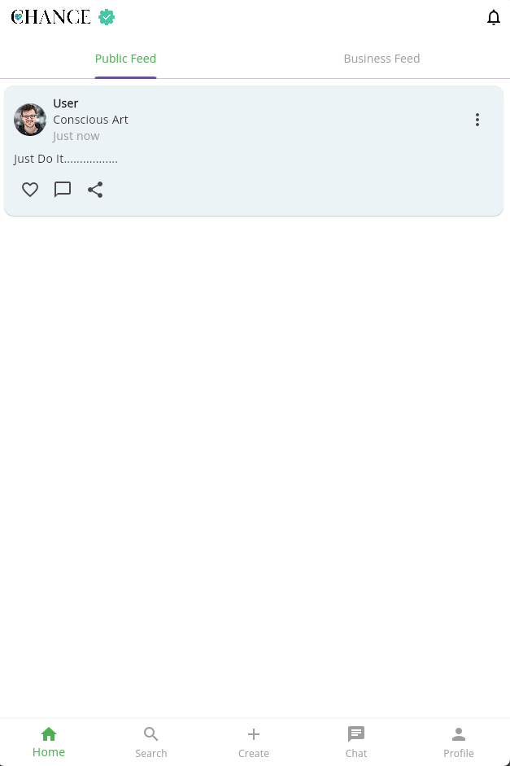
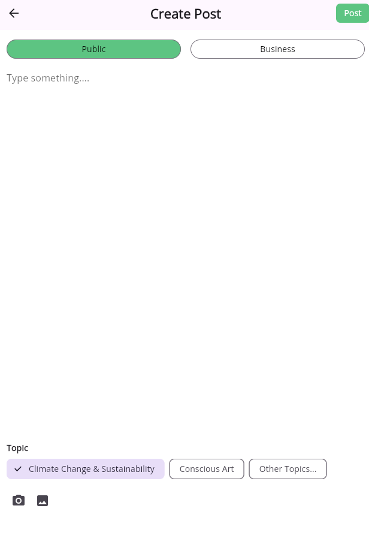
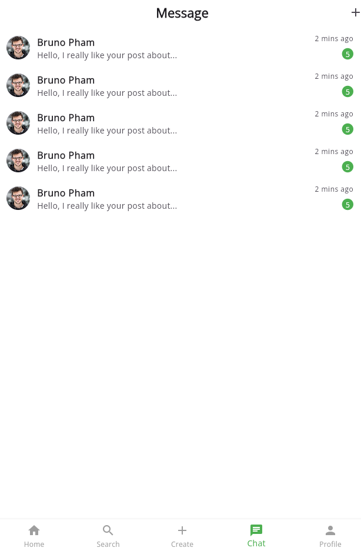

# CHANCE App

This is a Flutter project for the CHANCE application.

## Screenshots




## Flutter Version

This project is designed to work with Flutter versions 2.10.0 and above. It has been tested with the following versions:

- Flutter 2.10.0
- Flutter 3.0.0
- Flutter 3.13.9

If you encounter any issues related to Flutter versions, please report them in the project's issue tracker.

## Getting Started

1. Ensure you have Flutter installed on your machine. If not, follow the [official Flutter installation guide](https://flutter.dev/docs/get-started/install).

2. Clone this repository:
   ```
   git clone https://github.com/your-username/chance-app.git
   ```

3. Navigate to the project directory:
   ```
   cd chance-app
   ```

4. Get the dependencies:
   ```
   flutter pub get
   ```

5. Run the app:
   ```
   flutter run
   ```

## Troubleshooting

If you encounter any issues:

1. Make sure your Flutter installation is up to date:
   ```
   flutter upgrade
   ```

2. Clean the project:
   ```
   flutter clean
   flutter pub get
   ```

3. If problems persist, please check your Flutter version:
   ```
   flutter --version
   ```
   And report the issue along with your Flutter version information.